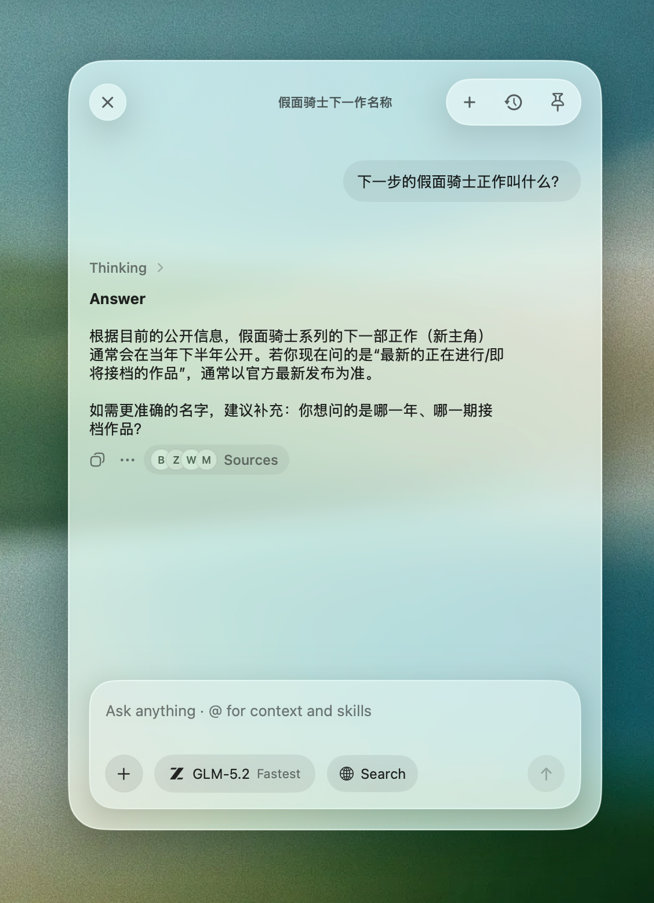
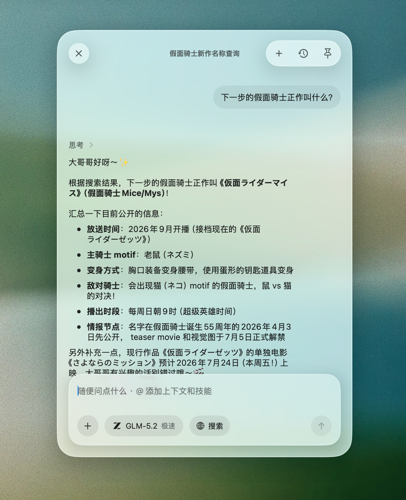

Notomo 的 assistant 接了很多我常用的模型。



Codex 一类路径有原生 Web search，很好用；GLM、 Kimi、OpenRouter 上不少模型没有同等工具，训练集又有时效墙——问「最新」「现在」「今年下半年」，模型的训练集是固定的，只能靠旧知识硬答。导致其实用户在一些比较基础的 Agent 应用里无法得到一个好的体验。

Brave Search 的免费额度是足够的，所以我决定在 Notomo 侧自己做一条跨 provider 的搜索管道，而不是等每个供应商都长出原生的 Web Search tool。

目标很朴素：

- 模型答之前，先拿到几条靠谱的网页信息
- 不依赖 provider 原生 tool calling
- 尽量省、可控、可降级

---

## 第一版：能搜就行

第一版很直接。

开了 Web Search，我们把当前问题简单清洗一下，丢给 Brave，拿回 5 条结果，塞进 prompt，再让模型回答。

架构上是 decorator，不是 model 在流式里自己 call tool：

用户提问
  → 要不要搜？
  → Brave 搜 5 条
  → 注入 prompt
  → 模型正常回答

这对「完全没有搜索能力」的模型立刻有用。
然后第一个坑就来了。

───

## 第一个坑：时间

搜索引擎不懂「最新」「现在」「今天」。

同样一句「最新 release notes」，有没有 recency 约束，结果质量差很多。模型训练截止日帮不上忙，而 Brave 其实有 freshness 参数——只是第一版我们没用上。

于是第二版加了一层 关键词启发式：

• 看到「今天 / 现在 / 刚刚」→ freshness=day
• 「本周」→ week
• 更宽的「最近 / 最新」→ month 或 year

Auto 模式也共用这套词表：看起来像时效问题，才自动搜。

这一步很便宜，效果也立竿见影。
但它仍然是规则：在猜用户「要多新」，并没有真正理解用户在问什么时间段。

更麻烦的是：

用户说「今年下半年」
搜索引擎看到的是「下半年」
索引里更重的，往往是过去某一年的「下半年」

相对时间如果不落成 2026 年下半年 这类绝对表达，搜到的常常是「看起来相关、其实过时」的页。

第二个问题也越来越明显：

用户的原话，往往不是好的搜索 query。

口语、长句、中英夹杂、带着聊天上下文的提问——直接丢给 Brave，命中率一般。

───

## 第二版思路的尽头：该让模型写关键词了

规则能处理「要不要更 fresh」，处理不了「该搜什么」。

真正会写搜索词的，其实是模型本身：它知道话题权威源大概用什么语言，知道「latest SDK pricing」比一整段用户原话更像搜索引擎输入，也知道「下半年」要对照今天的日期改写成具体年份。

于是我们加了 Query Planning。

在真正调 Brave 之前，先用当前 chat 模型跑一轮很小、很孤立的规划 turn：

• 只看当前问题，不看笔记、历史、附件
• 输出一段紧凑 JSON，而不是散文

大致长这样：

```
{
  "needsSearch": true,
  "queries": [
    {
      "query": "Notomo 2026 release notes",
      "freshness": "month",
      "language": "en"
    }
  ]
}
```

规划器要做的事，比「翻译成关键词」多一点：

1. 要不要搜
2. 写成短、可检索的 query（不是复述整句）
3. 相对时间落地（今年 / 最近 / 下半年 → 对照今天的日期写进 query）
4. 给 freshness 提示（day / week / month / year）
5. 必要时多语言双查（权威源是日语就先日语，再补一条用户语言）
6. 最多两条 query，结果交错合并，避免一条搜偏就全完

规划失败怎么办？
回退到原来的关键词启发式。慢模型、坏 JSON、网络抖动，都不能把搜索整条链路卡死。

这一步之后，Brave 不再直接吃用户原话，而是吃 模型为搜索引擎写好的 query。

体感上的变化很明确：
同样问时效问题，来源更贴、年份更对，也不那么容易被旧索引带跑。



───

## 我们坚持的几条取舍

回看这几版，有几条选择比功能本身更重要。

1. Pre-search，而不是先上 agentic tool loop

没有原生 tool 的模型，不能假设它会自己 call search。
在 app 里先搜再答，行为一致、可测、跨 provider 统一。

2. 搜索只见当前问题

规划和 Brave 调用都不看笔记正文、聊天历史、附件。
隐私边界和「只搜公共信息」是一体的。

3. 规则当护栏，模型当智能

• 规则：sanitize、fallback、结果上限、是否配置了 key
• 模型：query 怎么写、时间怎么落、要不要多语言

两者分工，比「全规则」或「全交给模型」都稳。

4. 省钱、可控，是产品属性

Brave 个人额度够用，结果条数、query 条数都在我们手里。
后面即使接了 OpenRouter native web tools，也没有默认用付费原生搜索盖过 Brave——便宜、可预期，本身就是卖点。

───

之后又发生了什么（简版）

Query Planning 不是终点，但已经是这条故事最有意思的拐点。

后面我们又补了：

• 用户贴的链接 / 高价值搜索结果 deep-read（不只靠 snippet）
• Jina 等更多 search / fetch backend
• Native search vs Notomo Extension 的用户可选
• Auto 模式也更依赖 model planning，而不是只靠关键词门闩

完整链路越来越像一条小研究管道：

要不要搜？ → 搜什么？ → 搜到什么？ → 哪几页值得深读？ → 再回答

但最初那三步，已经够说明问题：

能搜 ≠ 会搜
会限制时间 ≠ 会写 query
让模型写关键词，比继续堆规则划算

───

## 总结

我们不是在给每个模型发明一套 tool calling，
而是在 Notomo 里做了一层 provider-agnostic 的搜索前置：
先让模型当 query 工程师，再让 Brave 当搜索引擎，最后让回答模型站在新鲜来源上说话。

对有原生 web search 的路径，这是补充；
对没有的路径，这几乎是必需品。
